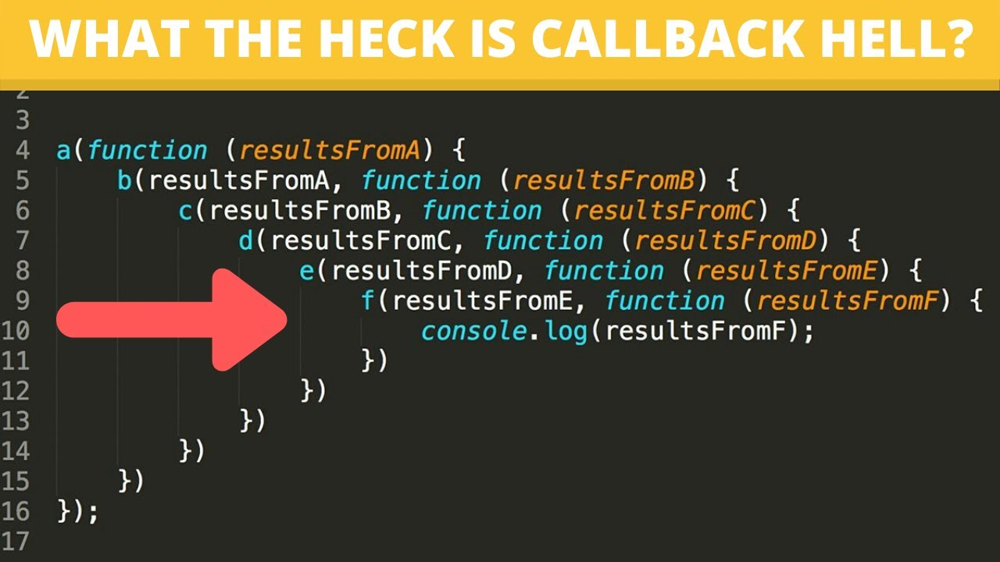

# Promise

우리가 지금까지 Callback을 이용하여 결과값이 나오기를 기다린 후 해당 결과값을 받아서 처리를 진행하는 방식으로 코딩을 해 왔습니다.

하지만 콜백을 자주 사용할 경우 Callback hell에 빠진다고 02-3의 fs를 할 때 잠깐 설명을 드렸었지요.



이를 보안하기 위해 나온 것이 es6에서 Promise입니다.

Promise 객체는 비동기 작업이 맞이할 미래의 완료 또는 실패와 그 결과 값을 나타냅니다.

프로미스에 대해서 간단히 알아보기 위해 다음의 예제를 해 봅시다.

```javascript
const condition = true;
const promise = new Promise((resolve, reject) => {
  if (condition) {
    resolve("성공");
  } else {
    reject("실패");
  }
});

promise
  .then((msg) => {
    console.log(msg);
  })
  .catch((err) => {
    console.log(err);
  });
```

Promise 객체는 resolve와 reject를 이용하여 성공과 실패를 반환하고, promise가 있는 객체에서는 then과 catch로 성공과 실패를 반환합니다.

then을 여러개 사용이 가능합니다.

```javascript
const condition = true;
const promise = new Promise((resolve, reject) => {
  if (condition) {
    resolve("성공");
  } else {
    reject("실패");
  }
});

promise
  .then((msg1) => {
    return new Promise((resolve, reject) => {
      resolve(msg1);
    });
  })
  .then((msg2) => {
    return new Promise((resolve, reject) => {
      resolve(msg2);
    });
  })
  .then((msg3) => {
    console.log(msg3);
  })
  .catch((err) => {
    console.log(err);
  });
```

Promise를 어떻게 쓰는지 제대로 감이 아직 안잡히는데 Promise를 함수에 넣어서 작업 해 봅시다.

```javascript
function sum(a, b) {
  return new Promise((resolve, reject) => {
    resolve(a + b);
  });
}

function minus(a, b) {
  return new Promise((resolve, reject) => {
    resolve(a - b);
  });
}

sum(1, 2)
  .then((val) => minus(val, 1))
  .then((val) => {
    return minus(val, 1);
  })
  .then((val2) => {
    console.log(val2);
  });
```

참고로 처음에 있는 then에는 {}도 없고, return도 없습니다.

{}가 들어가는 순간 return이 필요해 진다는 것을 기억 해 주세요.
