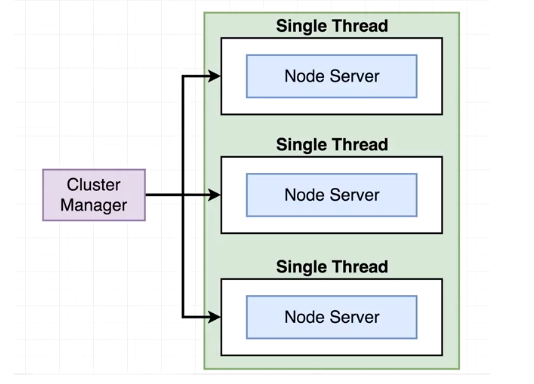

# PM2

우리가 서비스를 오픈 한다고 생각 해 봅시다. 지금까지의 우리는 터미널이 종료가 되면 노드 서버도 같이 종료가 됩니다. 그러므로 서버 컴퓨터를 종료하지도 못하고 불안하게 서버를 지켜 보고 있을 것 같지 않나요?

우리가 터미널에서 서버에 대해서 걱정 하지 않고, 컴퓨터만 켜져 있다면 알아서 서버를 구동 시켜주는 것이 있으면 좋지 않을까요?

그래서 나온 프로세스 관리자가 PM2입니다.

## 설치 법

```npm
npm install pm2 -g
```

## 기본 사용법

### 사용법 찾기

기본적인 사용 방법이 궁금하다면

```bash
pm2 -h
```

를 입력하면 기본적인 사용법이 나옵니다. 이는 다른 전역 모듈에서도 비슷하게 사용 가능합니다.

### 프로세스 관련 명령어

```bash
pm2 start app.js // 프로세스 시작
pm2 list // 현재 실행 중인 프로세스 확인
pm2 restart (번호, 이름) // 프로세스 재 시작
pm2 stop (번호, 이름) // 프로세스 정지
pm2 delete (번호, 이름) // 프로세스 삭제
```

### start 관련 옵션

```bash
pm2 start app.js --name app
pm2 start app.js --watch
```

### 로그 보기

```bash
pm2 logs // 실행중인 모든 프로세스의 로그
pm2 logs (번호, 이름) // 해당 프로세스의 로그
```

## Cluster mode

Node.js 애플리케이션의 경우 PM2에는 생성된 각 프로세스 간에 모든 HTTP[s]/Websock/TCP/UDP 연결을 공유하는 자동 로드 밸런서가 포함되어 있습니다. 응용 프로그램을 클러스터 모드로 시작하려면

```bash
pm2 start app.js -i (숫자, 0, max) // 해당 숫자만큼 프로세스가 클러스터모드로 시작됩니다. 0과 max는 최대 수 만큼 됩니다.
```

## 모니터 모드

pm2에서 자체적으로 제공하는 모니터기능이 있습니다. 해당 기능은 항상 적확하지 않을 수 있습니다.

```bash
pm2 monit
```

## 환경 변수 (Ecosystem File)

pm2에 대한 설정을 미리 지정해 놓을 수 있는 파일로 "ecosystem.config.js" 파일을 생성하여 생성하려는 파일에 적용하여 실행 할 수 있습니다.

개발 환경에서는 해당 파일을 개발에 맞추어 설정 해 놓고 서버에 서비스를 위해서 올릴 때에는 해당 파일에 맞춰 올릴 수 있습니다.

Ecosystem File을 만드는 방법은 다음과 같습니다. terminal에서 폴더로 이동 한 후 아래의 명령어를 입력 해 줍니다.

```bash
pm2 init simple
```

그러면 아래의 파일이 생성이 됩니다.

```javascript
module.exports = {
  apps: [
    {
      name: "app1",
      script: "./app.js",
    },
  ],
};
```

pm2에서 많이 쓰이는 옵션들에 대해서 알아 봅시다.

```javascript
module.exports = {
  apps: [
    {
      name: "이름을 지정 할 수 있습니다.",
      script: "스크립트 시작 위치입니다.",
      watch:
        "파일 변경 시 자동으로 재시작 할 것인지 묻습니다. 해당 옵션은 false가 default입니다.",
      env: {
        // 옵션 없이 시작 시 해당 옵션이 default입니다.
        NODE_ENV: "development",
      },
      env_production: {
        // --env production 옵션을 주면 해당 옵션이 추가됩니다.
        NODE_ENV: "production",
      },
      instances: 1, // 실행시킬 인스턴스(프로세스)의 수 입니다.
      exec_mode: "cluster", // 실행 모드 입니다. cluster와 fork가 있으며 default는 fork입니다.
    },
  ],
};
```

여기서 마지막의 옵션인 cluster와 fork에 대해서 간단히 알아보자.

---

### cluster와 fork

cluster와 fork 둘 다 코드를 복사하여 자식 프로세스를 실행한다는 개념은 동일합니다.


즉 내가 만든 코드를 하나의 프로세서에서 구동 할 것인지, 여러개의 프로세서에서 동시에 구동 할 것인지에 대한 차이입니다.

다만 cluster와 fork의 차이점은 두가지가 있습니다.

1. 포트를 공유 할 것인지에 대한 유무
2. 로그밸런싱을 할 것인지에 대한 유무

첫번째로 포트를 공유 한다는 의미는 첫번째로 켜지는 서버의 경우 3000번 포트를 사용 한다면 두번 째로 켜지는 서버의 경우에는 이미 이를 사용하고 있기 때문에 포트를 점유하지 못하여 에러가 발생합니다.

fork_cluster 폴더에서 이를 테스트 해 볼 수 있는 예제가 있습니다.

먼저 fork.js를 보면 fork를 담당하는 node의 기본 모듈인 child_process를 불러온 후 fork를 chidl1과 child2 두번 server.js를 실행하는 것을 알수 있습니다.

```javascript
const { fork } = require("child_process");

const child1 = fork("./server.js", ["child"]);
child1.on("error", (err) => {
  console.log(`child1에서 에러가 발생 했습니다. ${err}`);
});

const child2 = fork("./server.js", ["child"]);
child2.on("error", (err) => {
  console.log(`child2에서 에러가 발생 했습니다. ${err}`);
});
```

하지만 두번째는 포트를 점유하지 못하여 에러가 발생하여 동작하지 않는 것을 알 수 있습니다.

cluster.js에서는 cluster를 담당하는 node의 기본 모듈인 cluster를 불러온 후 마스터 프로세스일 경우 자식 프로세스를 실행 시키기 위해 cluster.fork()를 두번 실행하여 자식 프로세스를 두개 만드는 것을 알 수 있으며, 자식 프로세스에서는 서버를 생성하는데 8080포트를 두개 공유하는 것을 알 수 있습니다.

여기서 처음보는 단어인 마스터 프로세스와 자식 프로세스에 대해서 간단히 설명 하자면 마스터 프로세스는 최초로 실행되는 스크립트로 추후 실행이 되는 자식 프로세스를 관리하고 관찰 하고 있습니다. 그러므로 자식 프로세스에서 본격적으로 Task(작업)을 수행하고 최초에는 부모 프로세스로 들어와서 특정 스케쥴에 따라 자식 프로세스로 작업이 분배 된다고 생각 하면 됩니다.



이러한 cluster 작업을 pm2에서 명령어를 기반으로 별도의 코딩 없이 실행 시킬 수 있습니다.
